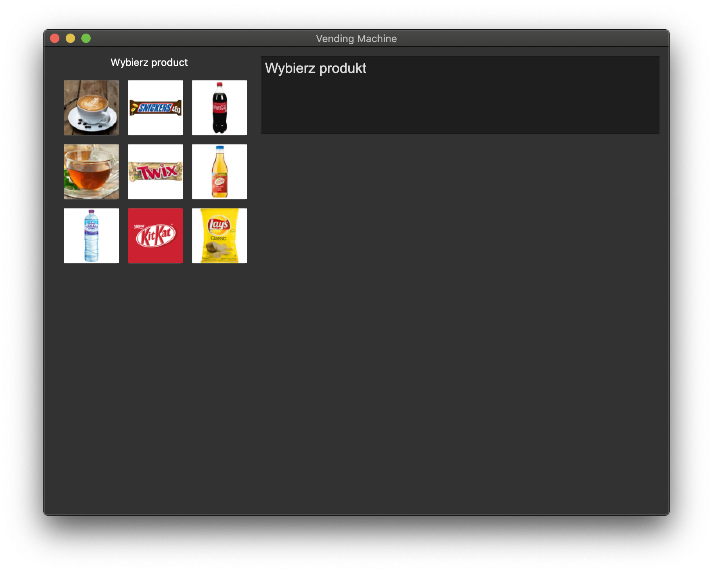
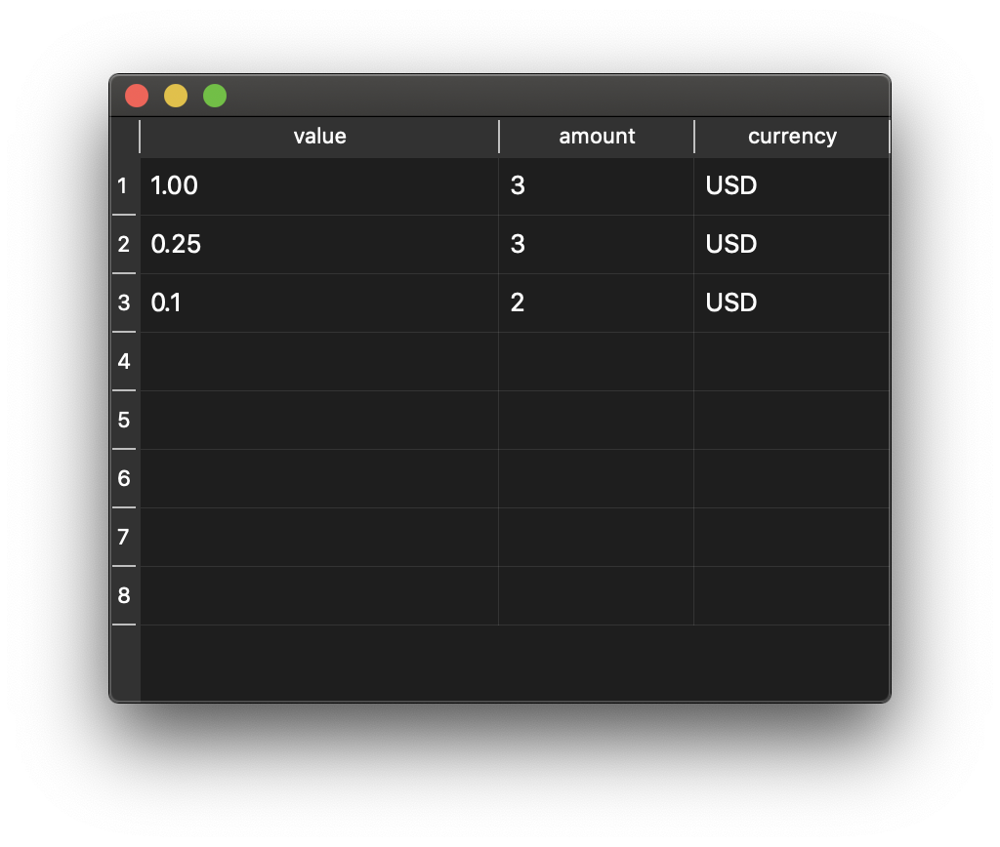

# Dokumentacja

Ten projekt jest napisany w języku **Python** za pomocą wieloplatformową bibliotecy do tworzenia interfejsów użytkownika [Qt](https://www.qt.io/) zaimplementowanej za pomocą biblioteki Python [PyQt5](https://pypi.org/project/PyQt5/)  

Opisuje pokrótce zasady wdrażania i korzystania z aplikacji.

## Grupa użytkowników aplikacji

Popyt na żywność i wielowalutowy automat z możliwością płatności kartą lub gotówką pozwalają na korzystanie z niej niemal wszędzie. Ale oto lista **najbardziej płodnych miesięcy**:

- Sklepy blisko granicy
- Międzynarodowe uniwersytety i wydarzenia
- Lotniska
- Centra handlowe w stolicach


## Instrukcja użytkowania

### Pulpit

Podgląd podczas otwierania programu. Użytkownik musi wybrać produkt z tabeli po lewej stronie. Interfejs wiadomości jest pokazany w prawym górnym rogu ekranu, gdzie będą wyświetlane wszystkie instrukcje i ostrzeżenia.



### Menu wyboru waluty

Użytkownik musi wybrać walutę, w której zapłaci za ten produkt:
1) W złotych
2) W dolarach
3) W euro


### Menu wyboru rodzaju płatności

Użytkownik musi wybrać, czy chce zapłacić **kartą** czy **gotówką**.

W złotych


W euro


### Menu płatności gotówką

W zależności od tego, jaką walutę wybrał użytkownik, doda do bankomatu monety w tej walucie. Istnieją cztery przyciski do wprowadzania monet.


Interfejs ekranu wyświetla kwotę do zapłaty i kwotę już zapłaconą.


Jeśli zdeponowane środki są niewystarczające, program wyświetli błąd na ekranie.


Po zakończeniu dodawania monet użytkownik musi kliknąć przycisk „Zapłać monetami”.


### Menu wyniku płatności gotówką

Po udanej wpłacie gotówkowej użytkownik może zobaczyć tabelę z resztą wskazanych nominałów i ich ilości. Ponadto użytkownik może zobaczyć tabelę nominałów bankomatu (tylko do celów szkoleniowych)


Tablica reszty




Tablica dostępnych nominałow


Jeśli użytkownik chce kupić coś innego, musi kliknąć przycisk „Wróc do początku”.


### Menu płatnosci kartą

W zależności od wybranej waluty, użytkownik będzie musiał wprowadzić kwotę do bankomatu, wybierając kartę i aplikując (naciskając przycisk). Użytkownik może zmieniać różne karty w różnych walutach. Można także zmienić użytkownika (tylko w celach edukacyjnych)


Wybor użytkownika


Wybor karty


Program wyświetli błąd, jeśli na koncie nie ma wystarczających środków do zapłaty


Po udanej operacji na ekranie zostanie wyświetlone saldo karty, którą zapłacił użytkownik. Jeśli użytkownik chce kupić coś innego, musi kliknąć przycisk „Wróc do początku”.
 


## Implementacja algorytmu wydawania reszty

To jest screen kodu implementacji wszystkiego bankomatu i w szczególności algorythm wydawania reszty. Przeanalizujmy ten algorytm punkt po punkcie 


Główną klasą vending-machine jest klasa „Core”. Ma różne atrybuty i metody do wywołania. Ale potrzebujemy tylko metody płatności gotówką, czyli ten metod:


Ta metoda jest wykonywana po naciśnięciu przycisku „Zapłać monetami”. Sprawdza, czy wystarczy monet do opłaty. Jeśli tak, to program wykonuje algorytm obliczenia reszty `self.calculateChange`.


Od razu, oblicza sumę które potrzebno wydać.

```python
...
toPay = self.enteredAmount - self.selectedProduct.price
...
```

Potem w załezności od wybranej waluty, program wybiera walutę i monety w tej walucie za pomocą metody `self.getCurrencyStore`. Ta metoda zwraca denominowaną klasę z losowo wygenerowanymi ilościami. 

Iterujemy według nominałów, które są sortowane od najwyższego do najniższego, żeby od razu wydawać najwiekszy możliwe nominały.

```python
for denomination in self.store.denominations:
    ...
```

Jeśli nie potrzebujemy już wydawać reszty, przerywamy wykonanie cyklu
```python
...
# if sum can already be given then break calculations
if toPay <= 0:
    break
```

Jeśli jeszcze potrzebujemy wydać reszty, wtedy obliczmy iłość do aktualnego nominała.

```python
...
# calculates maximum numbers of denominations in current denomination
numberOfDenominations = int(toPay // denomination.value)
...
```

Potem jeśli istnieje chociaż jeden nominał i jest dostępny w bankomacie, wtedy dodajemy iłośc tych nominałow do listy nominałow reszty i odejmujemy od całkowitej sumy reszty tą kwotę.

```python
...
# if denomination can be given and it exists in store then add
if 0 < numberOfDenominations <= denomination.amount:
    toPay = toPay - (denomination.value * numberOfDenominations)
    change.append(Denomination(denomination.value, numberOfDenominations denomination.currency))
```

Wreszcie, jeśli nadal musimy wydać resztę, ale cykl `for` się zakończył, wyświetlamy błąd, że nie możemy wydać reszty. W przeciwnym razie zwrócamy listę nominałów.

```python
# Display error if change can't be given
if toPay > 0:
    self.error = "Nie można wydać resztę"
    return None
else:
    return change
```

Po za tym algorytmem konwertujemy tą listę na słownik, aby wyświetlić ją w tabeli. I to jest implementacja algorytmu reszty.


